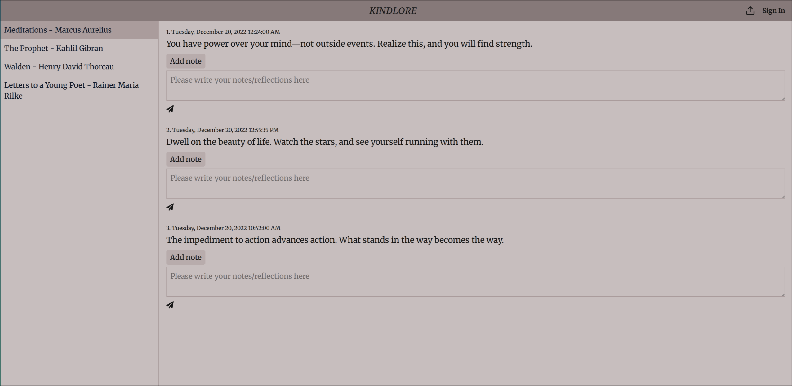

# Kindlore (in-progress)

A tool to upload, view, and reflect on your Kindle Clippings.txt file.

## Mission and Vision

Kindlore helps you organize and reflect on your Kindle highlights. Upload your clippings, view them in a beautiful UI, and add personal reflections to each entry. Your data is secure and deduplicated, so you can revisit and enrich your reading journey over time.




## Features

- **Upload Clippings:** Import your Kindle Clippings.txt file.
- **De-duplication:** Duplicate clippings are ignored, so you can safely re-upload.
- **Reflection:** Add notes and reflections to each clipping.
- **Encrypted Data:** Your data is encrypted at rest.
- **Authentication:** Sign in with Google for a personalized experience.

## Tech Stack

- **Frontend:** Next.js (App Router), React, Tailwind CSS, React Icons
- **Backend:** Next.js API routes, TypeScript
- **Database:** PostgreSQL, Prisma ORM
- **Authentication:** NextAuth.js (Google provider), Prisma Adapter
- **Dev Tools:** ESLint, TypeScript, dotenv

## Structure

```
├── src/
│   ├── app/                # Next.js app router pages and API routes
│   ├── components/         # Reusable React components (UI, header, sign-in/out)
│   ├── lib/                # Utility libraries (Prisma client)
│   ├── auth/               # Authentication logic and API routes
│   └── utils/              # Utility functions (user/session helpers)
├── prisma/
│   ├── schema.prisma       # Prisma schema (database models)
│   └── migrations/         # Prisma migration files
├── public/                 # Static assets (images, favicon, etc.)
├── docs/                   # Project documentation (vision, backlog, sprints)
├── .env                    # Environment variables
├── package.json            # Project dependencies and scripts
├── tsconfig.json           # TypeScript configuration
├── next.config.ts          # Next.js configuration
├── postcss.config.mjs      # PostCSS configuration
├── eslint.config.mjs       # ESLint configuration
├── README.md               # Project overview and instructions
└── .gitignore              # Git ignore rules
```

## For Recruiters

- Full-stack engineer with a focus on clarity, scalability, and user experience
- Projects demonstrate end-to-end skills: database design, API development, UI/UX
- Code is clean, modular, and production-ready

## Resume

Interested in my experience? [Download my resume](public/softwareEngineerPranshuChawlaResume2025.docx.pdf).

## Contact

- [LinkedIn](https://www.linkedin.com/in/pranshu-chawla-/)
- [GitHub](https://github.com/RayFrightener)
- Email: pranshuchawla19@gmail.com

---

Feel free to explore the code

## Commit Message Categories

| Category   | Use For                                           | Example                                      |
|------------|---------------------------------------------------|----------------------------------------------|
| **fix:**   | Bug fixes, typos, small readability edits         | `fix: correct typo in about page`            |
| **feat:**  | Adding new features, sections, or content         | `feat: add upload form for clippings`        |
| **refactor:** | Improving code, structure, or design (no new features) | `refactor: update reflection component layout` |
| **docs:**  | Documentation changes (README, comments, etc.)    | `docs: update project vision`                |
| **style:** | Formatting, CSS, or visual improvements           | `style: enhance header appearance`           |